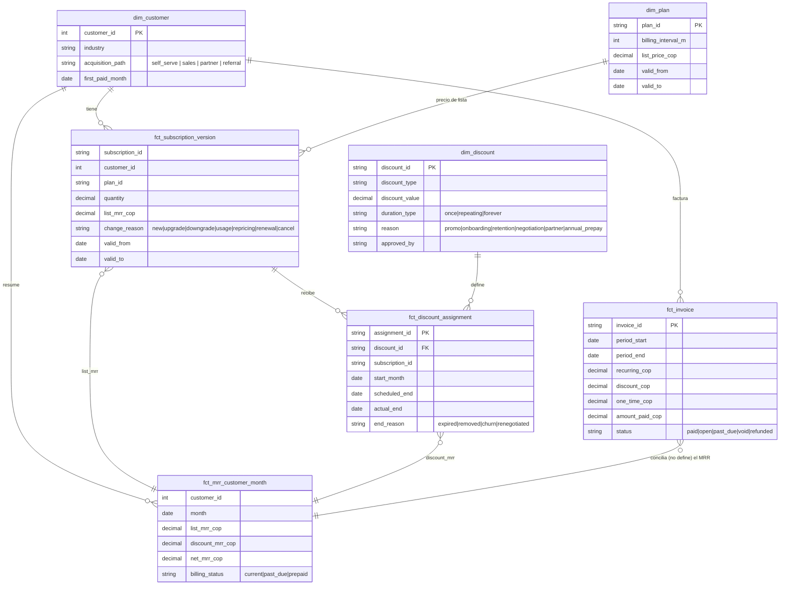

# Modelo de datos propuesto: MRR en dos capas

> Respuesta a la pregunta 2 del CFO: "¿Cómo separarías el valor de la suscripción del precio efectivamente pagado?"
> DDL ejecutable: [`sql/02_modelo_dos_capas_ddl.sql`](../sql/02_modelo_dos_capas_ddl.sql) · Clasificación: [`sql/03_movimientos_dos_capas.sql`](../sql/03_movimientos_dos_capas.sql)

## 1. La idea en una línea

**net MRR = list MRR − discount MRR.**
- `list MRR` mide lo que el cliente **compró**: plan, cantidad y uso, a precio de catálogo. Es **comportamiento del cliente**.
- `discount MRR` mide lo que **Finora decidió regalar**. Es una **decisión comercial**.
- `net MRR` es lo que el cliente paga de forma recurrente. Sigue siendo la **cifra oficial**: es conservadora y cuadra con la facturación.
- **La caja** (lo cobrado en el mes) vive aparte, en facturas. Mora, puestas al día, prepagos y cargos únicos **no son MRR**.

## 2. Diagrama

**Decisiones de diseño:**
- **Suscripción como historia (SCD tipo 2).** Cada cambio de plan, cantidad o uso abre una nueva versión con `change_reason`. Así se reconstruye el `list MRR` de cualquier mes, y la **subida de precio de catálogo** (`repricing`) queda separada del upgrade del cliente.
- **El descuento es una entidad con vigencia**, no un número neto en la factura. Su inicio y su fin son eventos observables, y además quedan registrados el **motivo**, el **aprobador** y el **dueño comercial**. Con eso se puede gobernar quién regala qué.
- **El MRR se deriva del contrato y se concilia contra la factura.** Una diferencia persistente es una alerta de calidad de datos, no un movimiento de MRR.
- **`billing_status` separa la mora del churn.** Un cliente `past_due` sigue en el MRR hasta que se confirma la cancelación, que es la práctica de ChartMogul (con churn automático configurable a los 1–90 días).

## 3. Reglas de clasificación (dos capas)

| Evento | Capa | Movimiento | Signo en el neto | ¿Por qué no se confunde? |
|---|---|---|---|---|
| Cliente nuevo | Cliente | `new` | + lista | — |
| Upgrade, más uso, más módulos | Cliente | `expansion` | + | Se mide a precio de lista |
| Downgrade, menos uso | Cliente | `contraction` | − | Se mide a precio de lista |
| Cancela | Cliente | `churn` | − lista | En la vista ejecutiva se agrupa con la liberación del descuento (churn neto) |
| Vuelve tras cancelar | Cliente | `reactivation` | + | Solo después de un churn **confirmado** (no tras un mes de mora) |
| Subida de precio de catálogo | Pricing | `repricing` | + | Es decisión de Finora, no del cliente |
| **Inicia un descuento** | Pricing | `discount_start` | − | **No es contracción**: la lista no cambia |
| Cambia el % de descuento | Pricing | `discount_change` | ± | — |
| **Termina un descuento** | Pricing | `discount_end` | + | **No es expansión**: el cliente no compró más |
| Mora, puesta al día, prepago, retroactivo | (caja) | — | 0 | Viven en `fct_invoice`, no en el MRR |

## 4. Las 3 preguntas del CFO, resueltas

| Caso | Modelo actual (caja) | Modelo propuesto: capa cliente | Capa pricing | Neto |
|---|---|---|---|---|
| Pagaba 100, ahora 80, **por descuento** | "Contracción −20" | 0 | `discount_start` −20 | −20 |
| Pagaba 100, ahora 80, **por downgrade** | "Contracción −20" (indistinguible) | `contraction` −20 | 0 | −20 |
| Creció de 100 a 130 con descuento de 30: sigue pagando 100 | "Sin cambio": **la expansión queda escondida** | `expansion` +30 | `discount_start` −30 | 0 |
| Termina ese descuento: paga 130 | "Expansión +30" (**error**) | 0 | `discount_end` +30 | +30 |

**Mensaje para el CFO:** *el cliente creció el mes en que hizo el upgrade, no el mes en que se venció el descuento.* Si el fin de un descuento cuenta como expansión, el NRR se infla y se premia a quien regaló el descuento.

Estos casos están en `tests/test_two_layer.py` y `tests/test_sql.py`, implementados en Python y en SQL con el mismo resultado.

## 5. Diccionario de métricas

| Métrica | Definición | Dueño | Decisión que habilita |
|---|---|---|---|
| **Net MRR** (oficial) | Σ (lista − descuento) recurrente del mes, sin impuestos ni cargos únicos | Finance | Reporte a junta, plan financiero |
| **List MRR** | Σ valor de la suscripción a precio de catálogo | Finance + RevOps | Crecimiento "real" del negocio subyacente |
| **Discount leakage** | List MRR − Net MRR (mensual y acumulado) | Finance | ¿Cuánto revenue no capturamos por decisiones comerciales? |
| **Price realization** | Net MRR ÷ List MRR, por segmento, canal, comercial y motivo | Finance + Sales | Política de descuentos, aprobaciones (deal desk) |
| **Discount-end pipeline** | MRR que vuelve por descuentos que vencen en 1–6 meses | Finance + CS | Proyección; preparar a CS antes del vencimiento |
| **Churn al vencer el descuento** | % de clientes que cancelan en el mes del fin del descuento vs. la línea base | CS + Growth | ¿El descuento compra clientes o solo los posterga? |
| **NRR / GRR (dos versiones)** | A lista (comportamiento) y neta (económica) | Finance | Si la brecha entre ambas crece, el crecimiento se está comprando con descuentos |
| **MRR en mora** | Net MRR de clientes `past_due` | Finance + Cobranza | Riesgo de churn involuntario; política de cobro |
| **Cash ≠ MRR (conciliación)** | Caja del mes − Net MRR, por tipo (mora, prepago, único) | Finance | Que la caja no se lea como comportamiento del cliente |

## 6. Cómo migrar sin parar el reporte (propuesta)

1. **Mes 1:** publicar el **modelo corregido** sobre los datos actuales, que ya separa mora, prepagos, retroactivos y subidas de precio (`finora/mrr.py`). La cifra de net MRR no cambia; cambia la explicación.
2. **Mes 1–2:** registrar **cada descuento nuevo** en `dim_discount` y `fct_discount_assignment` **antes** de lanzarlos. Es requisito para aprobar un descuento.
3. **Mes 2–3:** agregar `list_mrr` y `change_reason` desde billing (SCD2) y conciliar contra la factura.
4. **Desde el mes 3:** puente en dos capas, NRR a lista y neta, *discount leakage* y *discount-end pipeline* en el tablero mensual del CFO.
